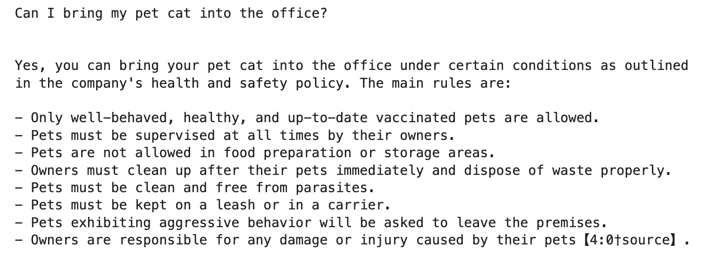

#  OpenAI Assistants API with File Search capabilities (UNDER CONSTRUCTION!!)

## Policy Explainer

I uploaded 2 files programmatically to OpenAI's Vector Store, one in `.pdf` and one in `.md` format, both covering policy documents for a ficticious company. OpenAI takes care of creating chunks and embeddings in an optimised way, no need to address these ourselves.
I'm using the Assistants API to search these files to answer user questions, using the uploaded files as embedded documents. The Assistant automatically decides which document to use and answers the related questions correctly:





## Data Visualizer

I uploaded the Microsoft Corporation's latest weekly stock price data for the last 2 years in `pdf` file format into OpenAI's Vector Store.
I enabled both the 'file_search' and the 'code_interpreter' tools for the Assistant and asked it to visualise the data:

`Prompt: Visualize the Microsoft Corporations stock prices for the last 2 years`


I repeated this exercise with providing a `.json` file instead of the `pdf` and OpenAI was able to create the same [result](visual_from_json.png). At the time of writing, other file formats, such as `.csv` or `.xlsx` were not supported for embeddings.

---

## How to run this project?

0. Prerequisites:

   - Make sure Python3 is installed.
   - If you don't have an account with OpenAI, create one here: https://openai.com/ then create a project API key under Dashboard / API keys.

1. Clone the project.

2. Create a virtual environment inside the project folder:

   `python -m venv venv`

3. Activate the virtual environment:

   Mac: `source venv/bin/activate`

   Windows: `venv\Scripts\activate`

4. Select interpreter in VSCode:

   (on Mac) - Cmd + Shift + P  ---> Select Interpreter ---> Select the created `venv` environment

   (on Windows) - 

5. Install the python dependencies:

   `pip install -r requirements.txt`


6. Create an `.env` file in the root folder and add your project's API key:

   ```
   OPENAI_API_KEY=your-unique-opanai-project-key
   ```

7. Run Jupyter Notebook:

   `jupyter notebook`

8. Run the code snippets in the given/desired order.


## Credits


- OpenAI: https://openai.com
